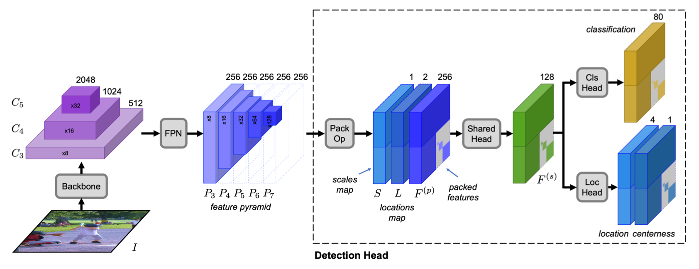
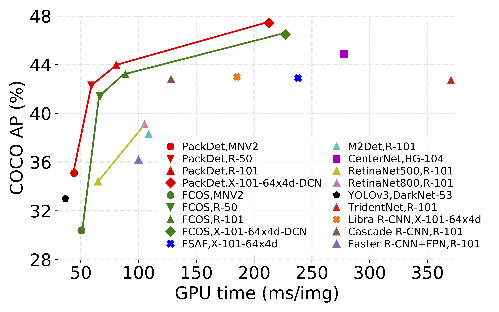
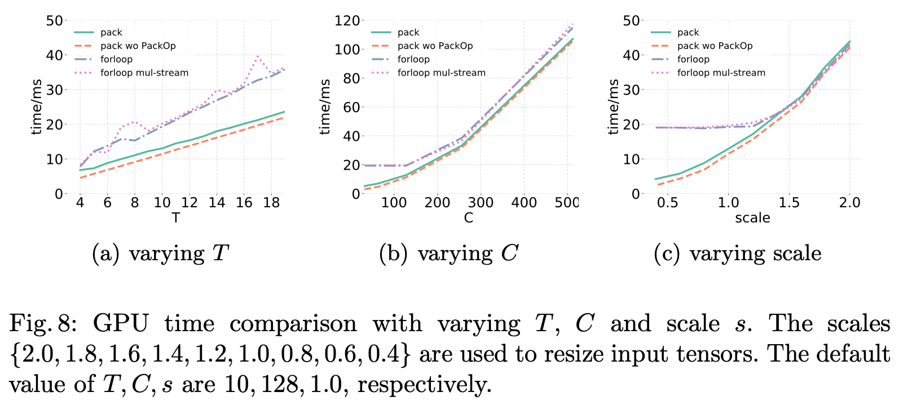

# PackDet: Packed Long-Head Object Detector

This is the implementation of "PackDet: Packed Long-Head Object Detector, ECCV'20" using [maskrcnn-benchmark](https://github.com/facebookresearch/maskrcnn-benchmark) framework.

<div align="center">

<p>Overview of PackDet with ResNet-50 as the backbone. PackOp stitches multiple feature maps (P3 ∼ P7) into a patchwork.</p>
</div>

<div align="center">

<p> Speed-accuracy balance on COCO test-dev set. PackDet is the proposed method.</p>
</div>


## Highlights

- **PackOp:** A universal algorithm to speed up FPN-like structure, which is demonstrated to be platform-agnostic.
- **Better Acuracy-Speed Trade-off:** Obtain higher accuracy-speed trade-off points against state-of-the-art anchor-free one-stage methods.
- **Cross-Head Group Normalization:** Normalize all head branches together, which improves accuracy notably.


## Updates

   - First commit (10/07/2020), which is based on the open-source [FCOS](https://github.com/tianzhi0549/FCOS) code.


## Installation

The installation is identical to [FCOS](https://github.com/tianzhi0549/FCOS), please check [INSTALL.md](INSTALL.md) for installation instructions.


## A quick demo

Once the installation is done, you can follow the below steps to run a quick demo.

    # assume that you are under the root directory of this project, and you have activated your virtual environment if needed.
    
    mkdir models
    # download packdet_R_50_FPN_1x_fe-128-12-2_m4_sep.pth and put it into the ./models/ folder
    python demo/demo.py


## Inference
Before running the following commands, you should first link the dataset. [link_coco.sh](datasets/link_coco.sh) gives an example to link the COCO dataset. You need to modify the paths therein, accordingly.

The inference command line on COCO dataset with a single GPU:

    python tools/test_net.py \
        --config-file configs/packdet/packdet_R_50_FPN_1x_fe-128-12-2_m4_sep.yaml \
        MODEL.WEIGHT models/packdet_R_50_FPN_1x_fe-128-12-2_m4_sep.pth \
        TEST.IMS_PER_BATCH 4

Note that, the COCO data split is specified in the yaml file. If you want to speed up the inference, 
you could use multiple GPUs:

    python -m torch.distributed.launch \
    --nproc_per_node=8 \
    --master_port=$((RANDOM + 10000)) \
    tools/test_net.py \
    --config-file configs/packdet/packdet_R_50_FPN_1x_fe-128-12-2_m4_sep.yaml \
    MODEL.WEIGHT models/packdet_R_50_FPN_1x_fe-128-12-2_m4_sep.pth \
    TEST.IMS_PER_BATCH 16


## Models

For your convenience, we provide the following trained models. The time is tested on 8 GTX 1080Ti GPUs with a batch size of 16.

| Model                                                        | Size     | schedule | split   | FPS  | AP   | AP50 | AP75 | APS  | APM  | APL  | BaiDu Pan                                               | Google Drive                                                 |
| ------------------------------------------------------------ | -------- | -------- | ------- | ---- | ---- | ---- | ---- | ---- | ---- | ---- | ------------------------------------------------------- | ------------------------------------------------------------ |
| [packdet_R_50_FPN_1x_fe-128-12-2_m2_sep](configs/packdet/packdet_R_50_FPN_1x_fe-128-12-2_m2_sep.yaml) | 1300x800 | 1x       | minival | 17.1 | 39.7 | 57.3 | 42.9 | 21.7 | 43.8 | 52.9 | [8x8w](https://pan.baidu.com/s/1ireycJpalN1Q8X1Tc19UKQ) | [file](https://drive.google.com/file/d/1eTvul88sRpd7tf3r8pjrpvhAcQ-bZUVi/view?usp=sharing) |
| [packdet_R_50_FPN_1x_fe-128-12-2_m4-nsp_sep](configs/packdet/packdet_R_50_FPN_1x_fe-128-12-2_m4-nsp_sep.yaml) | 1300x800 | 1x       | minival | 15.2 | 39.4 | 56.8 | 42.9 | 22.7 | 43.3 | 52.7 | [a967](https://pan.baidu.com/s/13uHVBV028ofkNfNZLI_B0A) | [file](https://drive.google.com/file/d/1DOL3jjEVblH5BSnQMYyOXElq67bdfdCF/view?usp=sharing) |
| [packdet_R_50_FPN_1x_fe-128-12-2_m4_sep](configs/packdet/packdet_R_50_FPN_1x_fe-128-12-2_m4_sep.yaml) | 1300x800 | 1x       | minival | 17.0 | 40.1 | 57.5 | 43.3 | 22.7 | 43.7 | 54.2 | [jdv8](https://pan.baidu.com/s/1-iskFZs_RNAhcahW9jERcA) | [file](https://drive.google.com/file/d/1eheA0A6FXxinTTYHRIJQ3JsikNY-uBCU/view?usp=sharing) |
| [packdet_R_50_FPN_2x_fe-128-12-2_m4_sep](configs/packdet/packdet_R_50_FPN_2x_fe-128-12-2_m4_sep) | 1300x800 | 2x       | minival | 16.8 | 42.3 | 60.1 | 46.1 | 26.7 | 46.0 | 56.0 | [yip7](https://pan.baidu.com/s/1kUzpdzcGw7bN7dkxdsLj_w) | [file](https://drive.google.com/file/d/1Mkq3zPe8-RqTJs19pUTKS8pRAo0AFVEt/view?usp=sharing) |
| [packdet_R_101_FPN_2x_fe-128-12-2_m4_sep](configs/packdet/packdet_R_101_FPN_2x_fe-128-12-2_m4_sep.yaml) | 1300x800 | 2x       | minival | 12.4 | 43.7 | 61.8 | 47.0 | 26.8 | 47.3 | 57.6 | [txwa](https://pan.baidu.com/s/1oJXIzUrC3Jjuz5m1Ss5gWQ) | [file](https://drive.google.com/file/d/1QkpYUu5xCmwnlQK7dXreAnQ7tuQ0-6bM/view?usp=sharing) |
| [packdet_dcnv2_X_101_64x4d_FPN_2x_fe-128-12-2_m4_sep](configs/packdet/packdet_dcnv2_X_101_64x4d_FPN_2x_fe-128-12-2_m4_sep.yaml) | 1300x800 | 2x       | minival | 4.6  | 47.1 | 65.8 | 51.4 | 28.9 | 51.0 | 61.8 | [8pqm](https://pan.baidu.com/s/1abNrdd_9rzRMFk789M0z1Q) | [file](https://drive.google.com/file/d/1rLTbF-YMwMHK7bZ706ItjyaEGw_8mGpK/view?usp=sharing) |
| [packdet_syncbn_bs16_MNV2_FPN_1x_fe-128-12-2_m4_sep](configs/packdet/packdet_syncbn_bs16_MNV2_FPN_1x_fe-128-12-2_m4_sep.yaml) | 1300x800 | 1x       | minival | 22.8 | 32.9 | 48.9 | 35.6 | 17.3 | 35.9 | 44.9 | [jn4f](https://pan.baidu.com/s/1R9kcA1T7-eIynpwKrM_oHA) | [file](https://drive.google.com/file/d/1yW4pEfhNla9_f8d-392xPl0GJipPntyh/view?usp=sharing) |
| [packdet_syncbn_bs16_MNV2_FPN_2x_fe-128-12-2_m4_sep](configs/packdet/packdet_syncbn_bs16_MNV2_FPN_2x_fe-128-12-2_m4_sep.yaml) | 1300x800 | 2x       | minival | 22.7 | 34.7 | 50.8 | 37.6 | 19.1 | 37.6 | 44.9 | [uhm4](https://pan.baidu.com/s/14t5Sc49CTpKRtUTdnzqQxA) | [file](https://drive.google.com/file/d/1iovalRFH6-t5wDxIAnyS4MP_4PqxpTO5/view?usp=sharing) |
| [retinapack_R_50_FPN_2x_fe-128-12-2_m4](configs/retina_pack/retinapack_R_50_FPN_2x_fe-128-12-2_m4.yaml) | 1300x800 | 2x       | minival | 8.9  | 38.7 | 57.5 | 41.6 | 22.6 | 42.3 | 51.8 | [mjgx](https://pan.baidu.com/s/1C549xUHIsLYsOOjojVWLHw) | [file](https://drive.google.com/file/d/1enCht7CRzT63WgmhD--tc4pZLOn8FQ-Z/view?usp=sharing) |

For the results on test-dev, please refer to the original paper.


## Training

The following command line will train `packdet_R_50_FPN_1x_fe-128-12-2_m4_sep` on 4 GPUs:

    python -m torch.distributed.launch \
        --nproc_per_node=4 \
        --master_port=$((RANDOM + 10000)) \
        tools/train_net.py \
        --config-file configs/packdet/packdet_R_50_FPN_1x_fe-128-12-2_m4_sep.yaml \
        DATALOADER.NUM_WORKERS 4 \
        OUTPUT_DIR training_dir/packdet_R_50_FPN_1x_fe-128-12-2_m4_sep

You should ensure the settings in `packdet_R_50_FPN_1x_fe-128-12-2_m4_sep.yaml` are correct.

For single GPU training, the command line is:

```
python tools/train_net.py \
    --config-file configs/packdet/packdet_R_50_FPN_1x_fe-128-12-2_m4_sep.yaml \
    DATALOADER.NUM_WORKERS 2 \
    OUTPUT_DIR training_dir/packdet_R_50_FPN_1x_fe-128-12-2_m4_sep
```

You can use tensorboardX to visualize the training process:

```
tensorboard --logdir ./tbx/packdet_R_50_FPN_1x_fe-128-12-2_m4_sep --host 192.168.20.223 --port 8888   --reload_multifile True
# change 192.168.20.223 to your host
```

You need to modify the yaml file to tune the visualization period.

You may use `tmux` to isolate different training procedures, note that [tmux may cause anaconda to use a different python source](https://unix.stackexchange.com/questions/366553/tmux-is-causing-anaconda-to-use-a-different-python-source). Use `which python` to ensure that you are in the correct environment.


## PackOp

PackOp is the proposed packing operator, which combines multiple feature maps into one at spatial. We benchmark the performance of PackOp on speeding up forward computatioin of multi-branch structure. Use [packop_timing.ipynb](tests/benchmark_packop/packop_timing.ipynb) for benchmark. The results are given as follows. The running environment is PyTorch-1.1.0, CUDA-9.0, cuDNN-7.3.0.



More results are given in supplementary material of the original paper.


## Contributing to the project

Any pull requests or issues are welcome.


## Citations

Please consider citing our paper in your publications if the project helps your research. BibTeX reference is as follows.
```
@inproceedings{packdet,
  title   =  {{PackDet}: Packed Long-Head Object Detector},
  author  =  {Ding, Kun and He, Guojin and Gu, Huxiang and Zhong, Zisha and Xiang, Shiming and Pan, Chunhong},
  booktitle =  {ECCV},
  year    =  {2020}
}
```


# Acknowledgments

We would like to thank [@tianzhi0549](https://github.com/tianzhi0549/FCOS) for their amazing work.


## License

This project is licensed under Apache License 2.0.
